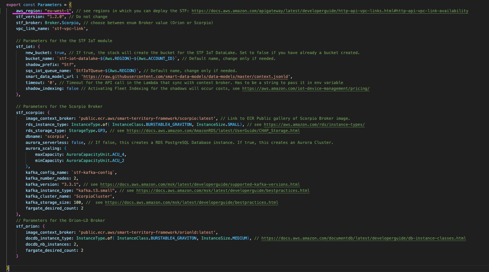

# Changelog

All notable changes to this project will be documented in this file.


## Version 1.1.0 

Repository renamed aws-stf-core (instead of aws-stf-core-scorpio).
<br>
Introducing the support of [Orion-LD Context Broker](https://github.com/FIWARE/context.Orion-LD) and merging in this repository, all implementations of the FIWARE Context Broker supported with STF.
<br> 
Adding parameter options for configuring Orion-LD
<br>
Adding a mechanism to ensure the stack is deployed in AZs that support VPC links for HTTP APIs as [https://docs.aws.amazon.com/apigateway/latest/developerguide/http-api-vpc-links.html#http-api-vpc-link-availability](List of AZs that support VPC links for HTTP APIs as https://docs.aws.amazon.com/apigateway/latest/developerguide/http-api-vpc-links.html#http-api-vpc-link-availability)

## Version 1.1.0 

### Parameters file

The parameters file [```parameters.ts```](./parameters.ts) provides more configuration options to customise the deployment like the type of instances to use for Amazon RDS (if not using Aurora) and Kafka (in Amazon MSK). 

<br>



<br> 

### Amazon RDS for PostgreSQL

Now, you can choose to deploy an Amazon RDS for PostgreSQL database or an Amazon Aurora PostgreSQL database. By default,the deployment relies on Amazon RDS for PostgreSQL. See the blog "[Is Amazon RDS for PostgreSQL or Amazon Aurora PostgreSQL a better choice for me?](https://aws.amazon.com/blogs/database/is-amazon-rds-for-postgresql-or-amazon-aurora-postgresql-a-better-choice-for-me/)" for more information. 

You can choose the type of instance and storage you want to use in the [```parameters.ts```](./parameters.ts) file. 


### Fleet Indexing

Since version 1.1.0, [Fleet Indexing](https://docs.aws.amazon.com/iot/latest/developerguide/iot-indexing.html) of named shadows `Stf-Device` is disabled by default. So, querying the list would only give you the list of things registered and not their entities. You can get the list of all entities of type `Device` directly from the Context Broker with the request `/ngsi-ld/v1/entities/?type=Device&limit=1000&offset=0`. If you need Fleet Indexing of named shadows, you can set the property `shadow_indexing` to true in the file [```parameters.ts```](./parameters.ts). __Fleet Indexing will incur [costs](https://aws.amazon.com/iot-device-management/pricing/).__

If you activate Fleet Indexing of named Shadows, you can now use the api `{StfCoreEndpoint}/iot/index` to add and request the NGSI-LD types used in [Fleet Indexing](https://docs.aws.amazon.com/iot/latest/developerguide/iot-indexing.html). 

[Note](https://aws.amazon.com/iot-device-management/pricing/) that Index updates are metered in increments of 1 KB. For example, an index update of 1.5KB is metered as two operations. Index updates occur when update your registry, device shadows, or device lifecycle events. For example, if you update a device shadow of 2 KB, your index update will also be 2 KB.


### Changes in the Lambda function that updates the Context Broker

The Lambda function that updates the Context Broker uses now the upsert operation `{StfCoreEndpoint}/ngsi-ld/v1/entityOperations/upsert`.

<br>


<br> 


## Version 1.0.0 

### STF single endpoint

The version 1.0.0 exposes a single endpoint for the FIWARE Context Broker API and the STF IoT API.

The API for the FIWARE Context Broker remains unchanged (`{StfCoreEndpoint}/ngsi-ld/v1/`) and fully compliant with NGSI-LD API as as defined [here](https://forge.etsi.org/swagger/ui/?url=https://forge.etsi.org/rep/NGSI-LD/NGSI-LD/raw/master/spec/updated/generated/full_api.json). 

The API for the STF IoT brings new capabilities. You can now query `GET {StfCoreEndpoint}/iot/things` to get this list of all the things registered including their named shadow `Stf-Device`.
With the single query `{StfCoreEndpoint}/iot/things/{thingName}`, you can also get all the entities associated to the thing.
Finally, with the STF IoT API you can also delete your things in the STF IoT Registry with the request `DELETE` `{StfCoreEndpoint}/iot/things/{thingName}`.

See [the README](./README.md#register-and-manage-your-things-using-the-stf-iot-api) for more details about this new capabilities. 

### Architectural changes of the STF IoT module 

In the new architecture, the SNS is removed. The IoT Rule triggers directly the SQS Queue to update and the Context Broker and Kinesis Firehose to feed the STF IoT Datalake. The construct IoT Datalake is now part of the STF IoT Core construct. 

<br>


<br>

### STF IoT Datalake

[Dynamic Partitioning](https://docs.aws.amazon.com/firehose/latest/dev/dynamic-partitioning.html) is now used in the STF IoT Datalake. Entities stored in the STF IoT Datalake are partitioned by `type` and time (`yyyy-MM-dd-HH`). See [the README](./README.md#register-and-manage-your-things-using-the-stf-iot-api) for more details about this new capabilities. 


